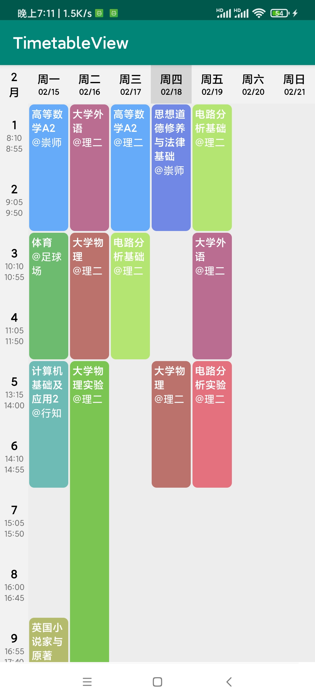

# TableView

TableView是一个安卓课程表UI库，使用本库可以实现基本的课程显示，并可对课程表UI进行基本的自定义。

### 功能特色

- 数据源可灵活定义
- 单日课程总数可自定义
- 可自动设置课程块背景颜色
- TableView内各部分颜色可自由设置
- 使用原生组件编写，无需考虑依赖冲突问题

### 效果预览



### 使用方法

#### 1.添加依赖

​	在工程根目录下的build.gradle添加

```gradle
allprojects {
    repositories {
        ...
        maven{url 'https://jitpack.io'}
    }
}
```

​	在app下的build.gradle添加

```gradle
implementation 'com.github.DevMeteor:TableView:1.2'
```

#### 2.属性定义

|          属性           |   格式    | 描述                                                         |
| :---------------------: | :-------: | ------------------------------------------------------------ |
|    tv_count_per_day     |  integer  | 单日课程总数（必需）                                         |
|    tv_resolve_flags     | reference | 字符数组，对应周一至周日，用于解析课程，默认为["mon", "tue", "wed", "thur", "fri", "sat", "sun"]，建议自行设置此项。 |
|  tv_indicator_bg_color  |   color   | 侧边栏背景颜色                                               |
| tv_indicator_text_color |   color   | 侧边栏文字颜色                                               |
|    tv_week_bg_color     |   color   | 星期栏背景颜色                                               |
|   tv_week_text_color    |   color   | 星期栏文字颜色                                               |
|  tv_lesson_text_color   |   color   | 课程块的文字颜色                                             |

​	**注：以上背景颜色默认为透明，文字颜色默认为黑色，如需设置整个课表背景可直接设置android:background="xxx"。**

以下参数可在dimen资源文件并进行覆盖使用

|         属性         | 描述                                                       |
| :------------------: | ---------------------------------------------------------- |
|  height_per_lesson   | 每个课程块的高度，控件的高度实际由本属性和单日课程总数决定 |
|   lesson_text_size   | 课程块的文字大小                                           |
| lesson_border_radius | 课程块四个角的弧度                                         |

#### 3.基本使用

​	在布局文件中添加

```xml
<cn.devmeteor.tableview.TableView
        android:id="@+id/main_table"
        android:layout_width="match_parent"
        android:layout_height="wrap_content"
        app:tv_count_per_day="10"
        android:background="#1F8F8F8F"
        app:tv_indicator_bg_color="#4DFFFFFF"
        app:tv_week_bg_color="#4DFFFFFF"
        app:tv_resolve_flags="@array/resolve_flags"/>
```

​	使用时需要把bean文件转化成Lesson类或继承自Lesson类，Lesson类的构造函数为

```java
/**
     *
     * @param term 学期
     * @param week 第几周
     * @param name 课程名
     * @param weekday 周几，对应tv_resolve_flags的项
     * @param start 从第几节课开始
     * @param end 到第几节课结束
     * @param place 上课地点
     */
public Lesson(String term, String name, String weekday, int start, int end, String place)
```

​	若需要可使bean文件继承Lesson类，示例：

```java
package cn.devmeteor.timetableview;

import cn.devmeteor.tableview.Lesson;

public class CustomLesson extends Lesson {

    private String week;
    private String teacher;
    private String date;
    private String identifier;

    public CustomLesson(String term, String week, String name, String weekday, int start, int end, String place, String teacher, String date, String identifier) {
        super(term, name, weekday, start, end, place);
        this.teacher = teacher;
        this.date = date;
        this.week = week;
        this.identifier = identifier;
    }


    public String getWeek() {
        return week;
    }

    public String getTeacher() {
        return teacher;
    }

    public String getDate() {
        return date;
    }

    public String getIdentifier() {
        return identifier;
    }

    @Override
    public String toString() {
        return getTerm()+getWeek()+getName()+getWeekday()+getStart()+getEnd()+getPlace()+teacher+date+identifier;
    }
}
```

​	在Activity中使用

```java
private TableView<CustomLesson> tableView;

    @Override
    protected void onCreate(Bundle savedInstanceState) {
        super.onCreate(savedInstanceState);
        setContentView(R.layout.activity_main);
        tableView = findViewById(R.id.main_table);
        tableView.setTimes(new String[]{
                "8:10",
                "9:05",
                "10:10",
                "11:05",
                "13:15",
                "14:10",
                "15:05",
                "16:00",
                "16:55",
                "17:50",
                "18:45",
                "19:40"
        }, new String[]{
                "8:55",
                "9:50",
                "10:55",
                "11:50",
                "14:00",
                "14:55",
                "15:50",
                "16:45",
                "17:40",
                "18:35",
                "19:30",
                "20:25"
        });
        try {
            tableView.setWeekStart(new SimpleDateFormat("yyyy-MM-dd", Locale.CHINA).parse("2021-02-15"));
        } catch (ParseException e) {
            e.printStackTrace();
        }
        tableView.setLessons(getCustomLessons(), getBgMap(), new LessonView.LessonClickListener<CustomLesson>() {
            @Override
            public void onClick(CustomLesson lesson) {
                Toast.makeText(MainActivity.this, lesson.toString(), Toast.LENGTH_LONG).show();
            }
        });
    }

//bgMap示例
private Map<String,Integer> getBgMap(){
        Map<String,Integer> bgMap=new HashMap<>();
        bgMap.put("高等数学A2", Color.parseColor("#ccFFFFF0"));
        bgMap.put("体育", Color.parseColor("#CC4CAF50"));
        bgMap.put("计算机基础及应用2", Color.parseColor("#CC4FAFA7"));
        bgMap.put("英国小说家与原著", Color.parseColor("#CCA8AF4C"));
        bgMap.put("大学外语", Color.parseColor("#CCAF4C7A"));
        bgMap.put("大学物理", Color.parseColor("#CCAF544C"));
        bgMap.put("大学物理实验", Color.parseColor("#CC5FBD2C"));
        bgMap.put("电路分析基础", Color.parseColor("#CCA6E252"));
        bgMap.put("思想道德修养与法律基础", Color.parseColor("#CC5271E2"));
        bgMap.put("电路分析实验", Color.parseColor("#CCE25263"));
        return bgMap;
    }

//模拟生成课程数据，自定义课程bean可直接替换
private List<Lesson> getLessons() {
        List<Lesson> lessons = new ArrayList<>();
        lessons.add(new Lesson("2018-2019-2", "高等数学A2", "mon", 1, 2, "崇师"));
        lessons.add(new Lesson("2018-2019-2", "体育", "mon", 3, 4, "足球场"));
        lessons.add(new Lesson("2018-2019-2", "计算机基础及应用2", "mon", 5, 6, "行知"));
        lessons.add(new Lesson("2018-2019-2", "英国小说家与原著", "mon", 9, 10, "崇师"));
        lessons.add(new Lesson("2018-2019-2", "大学外语", "tue", 1, 2, "理二"));
        lessons.add(new Lesson("2018-2019-2", "大学物理", "tue", 3, 4, "理二"));
        lessons.add(new Lesson("2018-2019-2", "大学物理实验", "tue", 5, 10, "理二"));
        lessons.add(new Lesson("2018-2019-2", "高等数学A2", "wed", 1, 2, "理二"));
        lessons.add(new Lesson("2018-2019-2", "电路分析基础", "wed", 3, 4, "理二"));
        lessons.add(new Lesson("2018-2019-2", "思想道德修养与法律基础", "thu", 1, 2, "崇师"));
        lessons.add(new Lesson("2018-2019-2", "大学物理", "thu", 5, 6, "理二"));
        lessons.add(new Lesson("2018-2019-2", "电路分析基础", "fri", 1, 2, "理二"));
        lessons.add(new Lesson("2018-2019-2", "大学外语", "fri", 3, 4, "理二"));
        lessons.add(new Lesson("2018-2019-2", "电路分析实验", "fri", 5, 6, "理二"));
        return lessons;
    }

```

#### 4.setTimes()

```java
	/**
     * 设置左边栏中的开始结束时间
     * @param starts 课程开始时间
     * @param ends 课程结束时间
     * starts和ends长度必须相同
     */
public void setTimes(String[] starts, String[] ends)
```

#### 5.setWeekStart

```java
	/**
     * 设置顶部栏显示月份和日期
     * @param date 本周一的日期
     */
public void setWeekStart(Date date)
```

#### 6.setResolveFlags

```java
	/**
     * 设置解析字符数组，下一次调用setLessons方法后生效
     * @param flags 解析字符数组
     */
public void setResolveFlags(String[] flags)
```

#### 7.setLessons()

```java
	/**
     * 更新课程数据
     * @param lessons 课程
     * @param bgMap 课程块对应颜色，课程名对应颜色值，不设置会使用随机颜色，可保证同名课程同色，但不同名课程块颜色可能相近而无法直观区分，建议自行添加bgMap
     * @param lessonClickListener 课程块点击事件
     */
    public void setLessons(List<T> lessons)
    
    public void setLessons(List<T> lessons, Map<String, Integer> bgMap)
    
    public void setLessons(List<T> lessons, LessonView.LessonClickListener<T> lessonClickListener)
    
    public void setLessons(List<T> lessons, Map<String, Integer> bgMap, LessonView.LessonClickListener<T> lessonClickListener)
```

